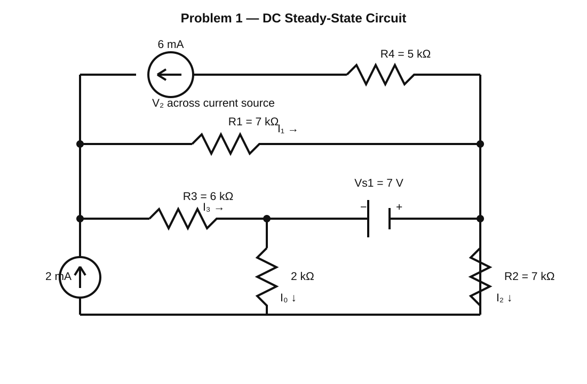
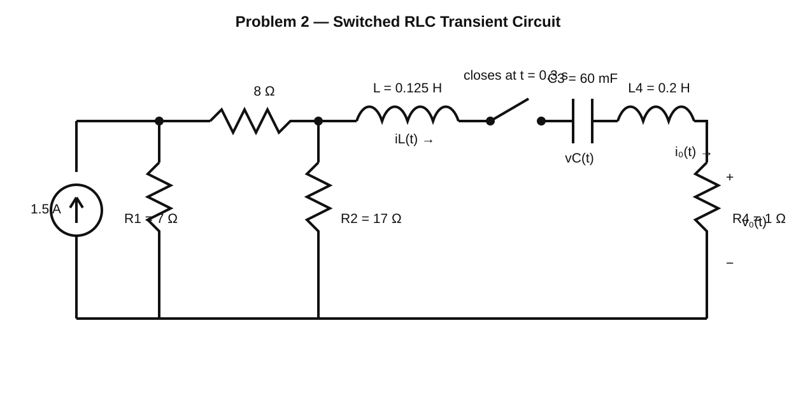

# PSpice Circuit Simulation

A PSpice-based circuit analysis project covering **DC steady-state analysis** and **switched RLC transient response**. The repository includes clean circuit diagrams, reconstructed SPICE/PSpice-style netlists, simulation results, and analysis based on the original ENEE2306 assignment report.

## Problem 1 — DC Steady-State Circuit



The first circuit contains resistors, two independent current sources, and a DC voltage source.

The simulation was used to determine:

- voltage across the upper current-source branch;
- branch currents;
- output current through the 2 kΩ resistor;
- source power;
- steady-state behavior.

### Reported Results

| Quantity | Result |
| --- | ---: |
| V2 | 21.44 V |
| I0 | 777.78 µA |
| I1 | 3.154 mA |
| I2 | 1.222 mA |
| I3 | 4.846 mA |

Because the circuit is driven entirely by DC sources and is analyzed at steady state, the measured voltages, currents, and source power remain constant with time.

## Problem 2 — Switched RLC Transient Circuit



The second circuit studies the transient response of an RLC network after a switch closes at:

```text
t = 0.3 s
```

The simulation examines:

- inductor current `iL(t)`;
- output current `io(t)`;
- capacitor voltage `vC(t)`;
- energy exchange between the inductor and capacitor;
- transition toward steady state.

After switching, the reactive elements exchange energy. The currents rise to a peak and then decay while the capacitor voltage approaches its steady-state value. Resistive losses dissipate the stored energy, preventing sustained oscillation.

## Circuit Files

The `circuits/` directory contains SPICE/PSpice-style netlists reconstructed from the values and topology shown in the submitted report:

- `circuits/dc_steady_state.cir`
- `circuits/rlc_transient.cir`

These files are intended as reproducible text representations of the submitted circuits.

## Repository Structure

```text
pspice-circuit-simulation/
├── circuits/
│   ├── dc_steady_state.cir
│   └── rlc_transient.cir
├── diagrams/
│   ├── dc-steady-state-circuit.svg
│   └── rlc-transient-circuit.svg
├── RESULTS.md
├── README.md
├── .gitignore
└── LICENSE
```

## Tools & Concepts

- PSpice / SPICE
- DC operating-point analysis
- Transient analysis
- RLC circuits
- Resistors, capacitors, and inductors
- Current and voltage measurement
- Source power analysis
- Switching circuits
- Waveform interpretation
- Steady-state and transient response

## Running the Netlists

Open the desired `.cir` file in a compatible SPICE/PSpice environment and run the included analysis directive:

- Problem 1 uses `.OP` for DC operating-point analysis.
- Problem 2 uses `.TRAN` for transient analysis.

The exact appearance of plots depends on the simulator used.

## Results

See [RESULTS.md](RESULTS.md) for a compact summary of the submitted simulation results and observations.

## Course

**ENEE2306 — Circuit PSpice Assignment**  
Electrical & Computer Engineering Department  
Birzeit University

## What I Learned

This project strengthened my understanding of circuit simulation, DC steady-state behavior, switched RLC response, waveform interpretation, source power analysis, and how simulation results reflect theoretical circuit behavior.

## Author

**Ameer Daibes**  
Computer Engineering Student — Birzeit University

[LinkedIn](https://www.linkedin.com/in/ameer-daibes-1510aa207)
